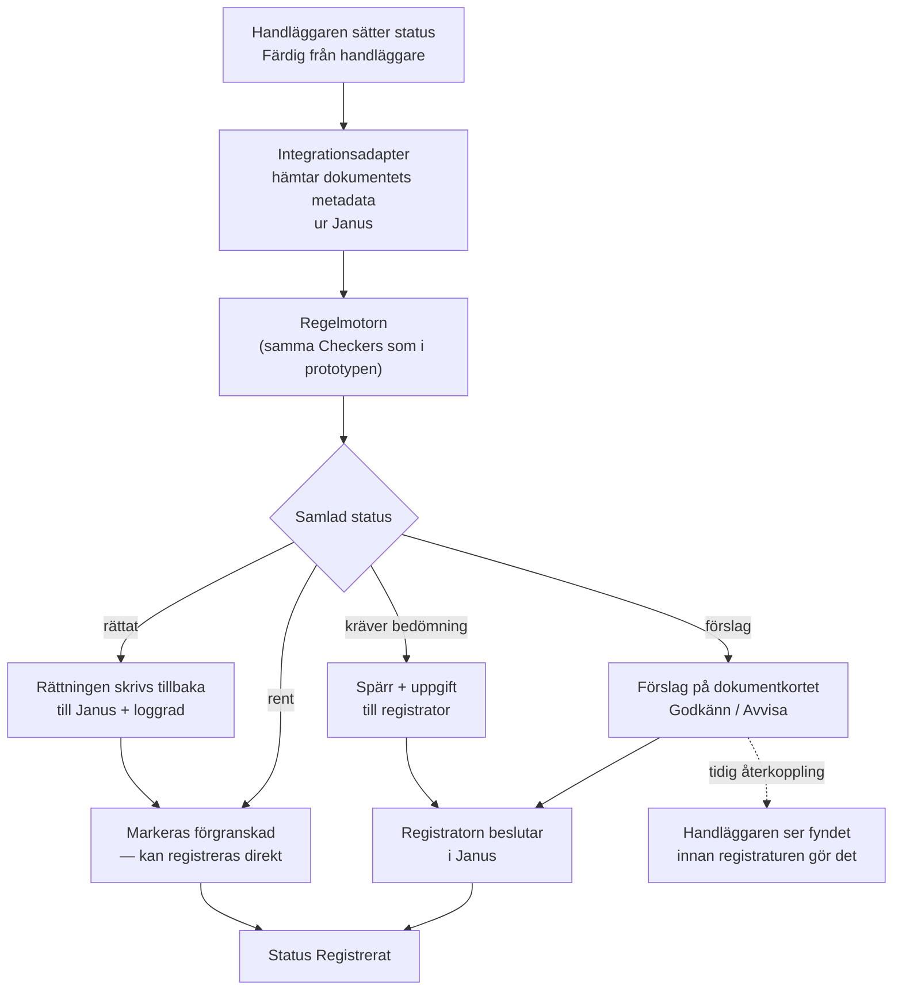

# Plan för integration i diarieflödet

Hur kvalitetskontrollen kan gå från fristående prototyp till en del av det
befintliga diarieflödet i Janus (Public 360) — utan att registratorn eller
handläggaren får nya manuella moment. Planen svarar på antagandet i `prd.md`
("en separat plan tas fram för hur lösningen senare kan integreras") och bygger
på besluten i `adr.md`.

Planen är ett underlag, inte ett beslut. Allt som rör P360:s tekniska
möjligheter är antaganden som måste bekräftas med systemförvaltningen och
leverantören — se *Öppna frågor*.

## Utgångspunkt: flödet i dag

Enligt instruktionshandboken och rutinen *Kvalitetssäkra ärenden*:

1. Handläggaren registrerar ett eller flera ärendedokument (dokumentkort) med
   titel, handlingstyp, dokumentkategori, skyddskod, datum, kontakt och filer.
2. Handläggaren sätter status *Färdig från handläggare/chef* eller *Diarieförd
   av handläggare*. Dokumentet hamnar i listan *Dokument redo för registrering*,
   som bara rollen Huvudregistrator ser.
3. Registratorn öppnar dokumentet, går igenom checklistan fält för fält och
   jämför med klassificeringsstrukturen.
4. Vid fel kontaktar registratorn handläggaren — eller rättar själv.
5. Registratorn sätter status *Registrerat*.

De manuella momenten som kostar är steg 3 och 4: varje dokument öppnas och
granskas för hand, och återkopplingen till handläggaren sker via mejl eller
samtal i efterhand. Business caset för en jämförbar registratur (ESV) anger
att bara runt 20 % av dokumentkorten hinner granskas och att 10–30 % av dem
innehåller fel. Siffrorna är en annan myndighets, men mönstret är detsamma.

## Princip: inga nya moment, bara färre

Integrationen ska hålla sig till sex regler. De är måttstocken för varje
designval nedan.

1. **Ingen ny knapp att trycka på.** Kontrollen startar av statusbytet som
   handläggaren redan gör i steg 2 — inte av att någon klickar *Kvalitetsgranska*.
   Knappen i prototypen är ett demoverktyg.
2. **Resultatet syns där arbetet redan sker.** Fynd, förslag och spärrar visas
   i Janus, på dokumentkortet och i listan *Dokument redo för registrering*.
   Ingen ska behöva logga in i ett andra system för att göra sitt jobb.
3. **Rena dokument kräver ingenting.** Ett dokument utan fynd ska inte behöva
   öppnas. Det är där den stora tidsvinsten ligger.
4. **Ett förslag är ett klick.** *Godkänn* skriver tillbaka värdet till Janus;
   *Avvisa* stänger förslaget och gör att det inte återkommer för samma värde.
5. **Ingen dubbel dokumentation.** Motorns logg — regel, före/efter-värde,
   tidpunkt — är dokumentationen av granskningen. Ingen ska föra egen
   anteckning om att kontrollen gjorts.
6. **Falsklarm är manuellt arbete.** En regel som flaggar fel för ofta kostar
   mer än den sparar. Den stängs av eller skärps, den lämnas inte på.

## Målbild

### Utfall mot åtgärd i Janus

| Utfall | Vad som händer i Janus | Manuellt moment i dag | Manuellt moment efter |
|--------|------------------------|-----------------------|-----------------------|
| Går vidare oberört | Dokumentet märks *förgranskat, inga fynd* | Öppna, gå igenom checklistan, sätt status | Sätt status — i bulk, och i sista etappen inget alls |
| Rättas automatiskt | Värdet skrivs tillbaka, loggrad sparas | Upptäcka felet, rätta, ev. kontakta handläggaren | Inget |
| Förslag | Förslag och förklaring visas på dokumentkortet | Upptäcka, bedöma, rätta | Ett klick: Godkänn eller Avvisa |
| Kräver mänsklig bedömning | Spärr mot *Registrerat*, uppgift med förklaring per flagga | Upptäcka (om dokumentet ingår i stickprovet), bedöma | Bedöma — men med fynden redan utpekade |

Fördelningen mellan utfallen är densamma som i prototypen och följer M3 och M5:
bara entydigt regelbaserade fel rättas utan människa.

## Arkitektur

Regelmotorn byggs inte om. Det som tillkommer är ett tunt lager runt den.

**Adapter mot diariet.** Prototypen läser ärenden ur `app/data/arenden.json`
via `app/data.py`. Det byts mot en adapter bakom ett gränssnitt med fyra
operationer — samma idé som `Checker` i `app/kontroller/modell.py`:

| Operation | Prototypen (mock) | Produktion (Janus) |
|-----------|-------------------|--------------------|
| Hämta ärende med dokument | Läs JSON | Läsanrop mot P360 |
| Skriv rättning | — (motorn arbetar på kopia) | Uppdatera fält på dokumentkortet |
| Skapa förslag eller spärr | Visas i webbappen | Kommentar, uppgift eller eget fält på dokumentkortet |
| Sätt status | — | Statusbyte till *Registrerat* |

Motorn arbetar redan på en kopia och lämnar tillbaka det rättade ärendet plus
en logg (`kvalitetsgranska` i `app/kontroller/motor.py`). Adaptern behöver bara
skriva tillbaka skillnaden — det som står i loggen med utfallet *rättad*.

**Utlösare.** I första hand en händelse från P360 när status ändras. Om P360
inte kan skicka händelser: en schemalagd hämtning var femte minut av dokument
med status *Färdig från handläggare* som inte redan är förgranskade.
Registratorn märker ingen skillnad mellan de två.

**Referensdata.** Klassificeringsstrukturen och kontaktregistret hämtas ur
Janus (Arkivadministration – klassificeringsstruktur) i stället för den
mockade delmängden i `app/data/klassificering.json`. Synkas nattligen, så
att en ny process i strukturen slår igenom utan kodändring.

**Omkörbarhet.** Ett dokument vars metadata inte ändrats granskas inte igen.
Ändrar handläggaren något efter förgranskningen körs kontrollen om, och gamla
fynd som inte längre gäller stängs automatiskt — samma sak som business caset
beskriver för markerade kommentarer vid statusbyte.

**Drift.** Tjänsten körs i myndighetens egen miljö med ett tjänstekonto som har
minsta möjliga behörighet: läsa ärenden och dokument, skriva de fält
automatiken får rätta, skapa kommentarer eller uppgifter. Kontot får inte
kunna ändra skyddskod eller avsluta ärenden.

## Införande i etapper

Varje etapp tar bort manuella moment utan att lägga till några. Man går vidare
först när kriteriet är uppfyllt — annars stannar man kvar och justerar reglerna.

| # | Etapp | Vad som byggs | Vad som blir enklare | Kriterium för att gå vidare |
|---|-------|---------------|----------------------|-----------------------------|
| 0 | Förberedelse | API-åtkomst till testmiljö, tjänstekonto, informationssäkerhetsklassning, konsekvensbedömning, utsedd regelägare | — | Läsåtkomst i testmiljö; klassningen godkänd |
| 1 | Skuggläge | Adaptern läser, motorn granskar allt som når *Färdig*. Inget skrivs till Janus. Resultatet jämförs med registratorns egen granskning | Inget ännu — registraturen arbetar som vanligt | Minst fyra veckors data. Regler med för hög falsklarmsfrekvens har åtgärdats |
| 2 | Förgranskning i Janus | Fynd, förslag och spärrar visas på dokumentkortet. Godkänn skriver tillbaka | Registratorn slipper leta fel själv; rena dokument behöver inte öppnas | Registratorerna upplever att fynden stämmer; andelen avvisade förslag är låg och stabil |
| 3 | Automatisk rättning och tidig återkoppling | Entydiga fel rättas direkt. Handläggaren ser fynden vid *Färdig*, innan registraturen tar över | Mejl och samtal om rättningar försvinner; felen rättas där de uppstår | Inga felaktiga automatiska rättningar under en hel period |
| 4 | Automatisk registrering av rena dokument | Dokument utan fynd får status *Registrerat* utan handpåläggning | Registratorn hanterar bara det som har fynd | Beslut av regelägaren; stickprov visar att rena dokument verkligen är rena |
| 5 | Språkförståelse (LLM) | Titelkontroll och matchning av handlingstyp mot innehåll via Claude API, bakom samma `Checker`-gränssnitt | Fler fel fångas som i dag kräver ögon | Dataminimeringen granskad; se nedan |

Etapp 1–4 motsvarar i stort business casets steg 1 och 2. Att låta systemet
skapa dokumentkorten själv (steg 3 där) ligger utanför den här planen.

## Människan i loopen

Automatiken får aldrig, i någon etapp:

- sätta, ändra eller ta bort skyddskod eller sekretessmarkering,
- ändra riktning (dokumentkategori) på ett dokument,
- godkänna sitt eget förslag,
- registrera ett dokument som har ett fynd med utfallet *kräver bedömning*,
- avsluta eller makulera ett ärende.

Vilka regler som får rätta automatiskt bestäms av regelägaren, inte av
utvecklingsteamet, och listan är kort: i dag datumformat och ifyllt *Kopia
till*. En regel flyttas från *förslag* till *rättas automatiskt* först när
skuggläget visat att den aldrig haft fel.

## Spårbarhet

Varje granskning lämnar en loggrad per fynd med regel, fält, före- och
efter-värde, utfall och tidpunkt — som i prototypen — kompletterad med:

- **regelversion**, så att det går att se vilken lydelse av regeln som gällde,
- **vem som beslutade** om förslag och bedömningar, och vad beslutet blev.

Det sista saknas i prototypen i dag: människans beslut lever bara i
webbläsaren (`review.md`, efter inkrement 4, punkt 2). I produktion sparas
beslutet både i Janus egen historik och i tjänstens logg. Om loggen utgör
allmän handling och hur länge den ska bevaras behöver arkivredogörelsen svara
på.

## Informationssäkerhet och juridik

- **Ingen ny lagring av handlingar.** Tjänsten läser metadata, inte filinnehåll,
  i etapp 1–4. Filerna ligger kvar i Janus.
- **Sekretess.** Ärenden med skyddskod eller sekretessmarkering granskas av
  regelmotorn men lämnar aldrig myndighetens miljö.
- **LLM-anrop (etapp 5).** Bara det fält kontrollen behöver skickas — titeln för
  en titelkontroll — aldrig ärenden med skyddskod, aldrig personnamn eller
  kontaktuppgifter om det inte är nödvändigt. Exakt vad som skickades loggas,
  så att det går att visa vad som lämnat systemet. Faller anropet eller är
  ärendet sekretessmarkerat blir utfallet *kräver bedömning*, aldrig *rent*.
- **Konsekvensbedömning.** En dataskyddskonsekvensbedömning görs innan etapp 1,
  och en förnyad bedömning innan etapp 5.
- **Transparens.** Varje fynd bär sin förklaringstext (M4). Den som ser en
  rättning i Janus ska kunna se att den gjorts automatiskt och varför.

## Förvaltning av regelverket

Checklistan för kvalitetskontroller i Janus är källan. Regelägaren — rimligen
registraturen — äger vilka regler som finns, deras förklaringstexter och
vilket utfall de ger. Varje regel har ett eget test (`uv run pytest -k
<regelnamn>` fungerar redan i prototypen), och en ändring i checklistan ska
kunna spåras till en ändring i regeln och dess test.

## Mätetal

| Mått | I dag | Mål |
|------|-------|-----|
| Andel dokument som granskas | ca 20 % (stickprov) | 100 % |
| Andel dokument som inte behöver öppnas av registrator | 0 % | Så hög som reglerna tillåter, mäts i etapp 1 |
| Andel avvisade förslag | — | Låg och sjunkande; hög andel = regeln ses över |
| Felaktiga automatiska rättningar | — | Noll |
| Tid från *Färdig* till *Registrerat* | Dagar | Samma dag för rena dokument |
| Manuella moment per rent dokument | Öppna, granska, sätta status | Inga (etapp 4) |

## Risker

| Risk | Följd | Motåtgärd |
|------|-------|-----------|
| För många falsklarm | Registratorn slutar läsa fynden — mer arbete, inte mindre | Skuggläge först; regel stängs av vid hög avvisningsgrad |
| Automatiken litas på blint | Fel slinker igenom som "förgranskat" | Stickprov på rena dokument även efter etapp 4 |
| P360 saknar lämpligt API eller händelser | Integrationen blir tyngre eller långsammare | Schemalagd hämtning som reserv; tidig kontakt med leverantören |
| Klassificeringsstrukturen ändras | Regler flaggar nya koder som fel | Nattlig synk ur Janus i stället för egen kodlista |
| Uppgraderingar av P360 bryter adaptern | Kontrollen stannar | Adaptern har egna tester mot testmiljön; tjänsten larmar när den inte kan läsa |
| Ansvaret blir otydligt | Ingen äger fel i reglerna | Utsedd regelägare från etapp 0 |

## Öppna frågor

1. Vilka webbtjänster exponerar Statskontorets version av P360 för ärenden,
   dokument och kontakter, och kan de skriva enskilda fält och kommentarer?
2. Kan P360 skicka en händelse vid statusbyte, eller måste tjänsten hämta?
3. Hur visas fynden bäst i Janus — kommentar, uppgift, eget metadatafält eller
   ett nyckelord (hashtag) som går att filtrera listan på?
4. Hur ska handläggaren nås vid tidig återkoppling — i Janus, i P360-panelen i
   Outlook eller via mejl? Business caset lämnar samma fråga öppen.
5. Vem är regelägare, och vem beslutar att en regel får rätta automatiskt?
6. Var ska tjänsten driftas, och vem förvaltar den efter införandet?

## Vad från prototypen som följer med

| Följer med oförändrat | Byts ut |
|-----------------------|---------|
| `Checker`, `Fynd` och `Utfall` (`app/kontroller/modell.py`) | `app/data.py` → adapter mot Janus |
| Alla regler i `app/kontroller/` och deras tester | `app/data/klassificering.json` → synk ur Janus |
| `kvalitetsgranska`, `samlad_status` och loggformatet (`app/kontroller/motor.py`) | Webbappens vy → visning i Janus; vyn blir kvar som översikt för regelägaren |
| Förklaringstexterna per regel | Beslut om förslag lagras i Janus och i loggen, inte i webbläsaren |
